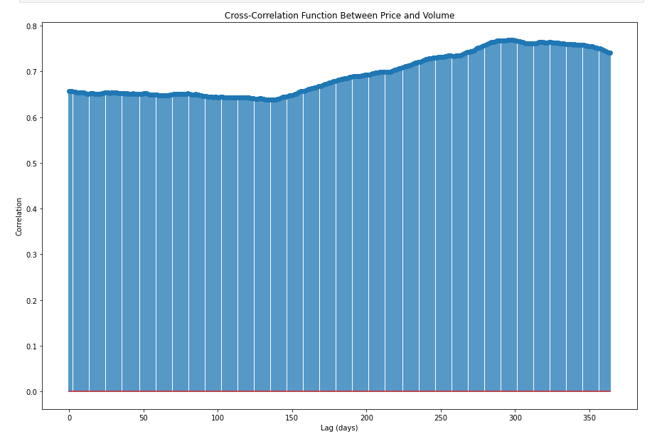
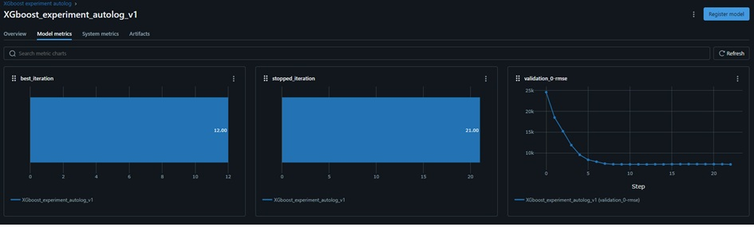

# Bitcoin Price Prediction – Time Series, MLflow, XGBoost.

The project includes a complete pipeline covering data processing, feature engineering, hyperparameter fine-tuning, and model training. MLflow is used to track experiment results.

# Table of Contents
- [Project Aim](#project-aim)
- [Technologies](#technologies)
- [Usage Example](#usage-example)
- [Repository Structure](#repository-structure)
- [Contact](#contact)

## Project Aim
The aim of the project is to create a predictive model that forecasts the Bitcoin price three days ahead. The project involves analyzing the time series of Bitcoin prices from January 1, 2015 to January 14, 2024, performing feature engineering, and training the model.

## Technologies
Below is a list of the key libraries and tools used in this project, along with a brief description of their roles:

- **Python 3.12.3**  
  The primary runtime environment and programming language.

- **NumPy** (`numpy`)  
  A fundamental library for numerical computations in Python. In this project, it is used for array (matrix) operations, vectorized transformations, and efficient handling of numerical data.

- **Pandas** (`pandas`)  
  A library for data manipulation and analysis using DataFrames. It is used to load, clean, merge, and prepare input data for subsequent pipeline stages.

- **Statsmodels** (`statsmodels.tsa`)  
  - `adfuller` (Augmented Dickey–Fuller test) – a stationarity test for time series, used to verify whether the series requires differencing.  
  - `seasonal_decompose` – decomposes a time series into trend, seasonality, and residual components, aiding in data structure analysis.  
  - `ccf` (Cross-Correlation Function) – a cross-correlation function used to examine relationships between two time series (e.g., Bitcoin price and other indicators).

- **Matplotlib** (`matplotlib.pyplot`)  
  A core plotting library for creating visualizations. In this project, it is used to visualize:  
  - the original time series (price over time),  
  - decomposition results (trend, seasonality),  
  - residuals and forecast diagnostics.

- **functools.reduce** (`functools`)  
  A standard Python library module; the `reduce` function allows iterative application of an operation (e.g., merging DataFrames) in a functional style. In this project, it is used to combine multiple feature sets into a single DataFrame.

- **XGBoost** (`xgboost`)  
  A high-performance implementation of gradient boosting on decision trees. In this project, it serves as the predictive model:  
  - `xgboost.DMatrix` – the data structure input for XGBoost,  
  - training an `XGBRegressor` model as the main algorithm for price prediction.

- **MLflow** (`mlflow`, `mlflow.xgboost`, `mlflow.sklearn`)  
  A platform for tracking and managing ML experiments:  
  - `mlflow.xgboost` – automatically logs parameters, metrics, and artifacts during XGBoost model training,  
  - `mlflow.sklearn` – similarly logs scikit-learn models or any preprocessing tools,  
  - Enables comparison of different hyperparameter versions and registration of the best model.

- **SciPy** (`scipy.stats`)  
  - `randint` and `uniform` – distributions used for random hyperparameter selection during `RandomizedSearchCV`.  
  SciPy provides a wide range of statistical functions and distributions, which is useful in the fine-tuning stage.

- **scikit-learn** (`sklearn`)  
  - `RandomizedSearchCV` – a tool for searching the hyperparameter space randomly (in the context of XGBoost) using cross-validation.  
  - `TimeSeriesSplit` – a data-splitting method (k-fold) that respects time order and does not mix future observations into training on past data.  
  - `mean_squared_error`, `mean_absolute_error`, `r2_score` – metrics for evaluating forecast quality (MSE, MAE, R² score).  
  - `mlflow.sklearn` – integration with MLflow for logging scikit-learn models and transformers.

- **Logging** (`logging`)  
  The standard Python module for logging messages. In this project, it is used to:  
  - record information about data processing steps,  
  - issue warnings or errors during pipeline execution,  
  - monitor the training and validation phases of the model.

Each of these libraries plays a role in the following pipeline stages:

1. **Data Processing**  
   - `pandas`, `numpy`, `statsmodels` (seasonality and stationarity analysis), `functools.reduce` (feature merging).

2. **Visualization and Exploratory Analysis**  
   - `matplotlib`, `statsmodels.tsa.seasonal` (displaying trend and seasonality).

3. **Feature Engineering**  
   - Creating lagged features using `pandas`/`numpy`, correlation analysis with `statsmodels.ccf`.

4. **Hyperparameter Tuning**  
   - `XGBoost` as the model, `RandomizedSearchCV` with `TimeSeriesSplit` and distributions `randint`/`uniform` from `scipy.stats`, all tracked via `mlflow`.

5. **Model Training and Evaluation**  
   - `XGBoost` (training), `sklearn.metrics` (evaluation), `mlflow.xgboost`/`mlflow.sklearn` (logging model and metrics), `logging` (execution monitoring).

This combination of tools results in a fully automated and tracked pipeline for time series analysis and Bitcoin price prediction using XGBoost.

## Usage Example
The project can be divided into two parts:  
- **Research Part** – contained in Jupyter notebooks.  
- **Production Part** – implemented as Python scripts.

### Research Part
In the `Data_cleaning.ipynb` notebook, data cleaning is performed. In the `Feature_Engineering.ipynb` notebook, time series analysis and feature engineering are conducted. Besides typical features such as assigning weekdays, holidays, etc., the stationarity of the time series is analyzed. 


Correlations between variables are also examined to create additional features.



As a result of this work, 165 additional features were generated. In the `Model_training_data_preparation.ipynb` notebook, the processed data is prepared for training.

### Production Part
The `XGboost_hyperparameter_tuning_final.py` script performs hyperparameter tuning for the XGBoost model. The results are logged as artifacts in MLflow. 


The `XGboost_training_model_final.py` script trains the model, and the results are saved as MLflow artifacts. 



## Repository Structure
```
├── data/
│ ├── cleaned/
│ │ └── cleaned_data.csv
│ ├── processed/
│ │ ├── best_features.csv
│ │ ├── specific_features.csv
│ │ ├── target_data.csv
│ │ ├── testing_data_X.csv
│ │ ├── testing_data_y.csv
│ │ ├── time_features.csv
│ │ ├── training_data_X.csv
│ │ ├── training_data_y.csv
│ │ ├── validation_data_X.csv
│ │ └── validation_data_y.csv
│ └── raw/
│ └── bitcoin.csv
├── images/
│ ├── 1.png
│ ├── 2.png
│ ├── 3.png
│ └── 4.jpg
├── notebooks/
│ ├── Data_cleaning.ipynb
│ ├── Feature_Engineering.ipynb
│ └── Model_training_data_preparation.ipynb
└── scripts/
├── XGboost_artifacts.csv
├── XGboost_hyperparameter_tuning_final.py
└── XGboost_training_model_final.py
```
## Contact
This project is released under an open-source license.  
- LinkedIn: [michał-jaros-88572821a](https://www.linkedin.com/in/michał-jaros-88572821a/)  
- E-mail: michal.marek.jaros@gmail.com  
